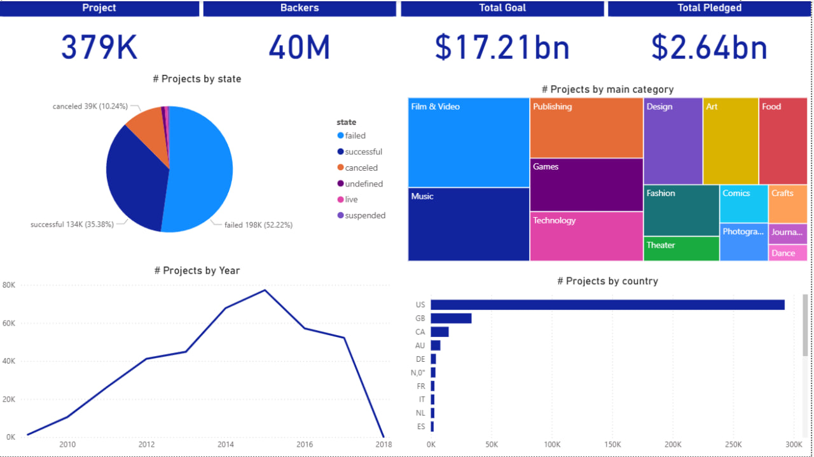

# Kickstarter Projects Analysis Dashboard

## Overview

This Power BI dashboard provides an analysis of Kickstarter crowdfunding projects across categories, countries, and years.

The dashboard helps identify project performance, funding trends, category distribution, and geographical insights.

## Dashboard Features

- Total Projects
- Total Backers
- Total Funding Goal
- Total Pledged Amount
- Project Status Analysis
- Category Analysis
- Country Analysis
- Yearly Trend Analysis

## Tools Used

- Power BI Desktop
- Power Query
- DAX
- Data Modeling

## Dashboard Preview

## Key Insights

- Failed projects represent the largest share of all projects.
- Film & Video and Music are among the most active categories.
- The United States dominates Kickstarter activity.
- Project creation peaked around 2015.

## Author

Abdulrahman Mohammed
